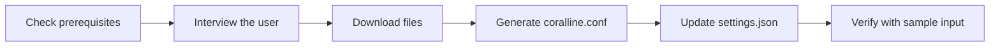

# coralline — AI Installation Playbook (bash)

> **⚠️ This installs the original bash statusline.** The recommended build is the native
> binary **coralline-rs** — faster, no `jq` dependency, cross-platform. Prefer
> **[rust/INSTALL.md](./rust/INSTALL.md)**. This bash playbook is kept for users who can't
> run a binary or want the pure-shell version.

> **You are an AI coding assistant** (Claude Code or similar) and a user asked you to install
> coralline. Follow this playbook top to bottom. Do not skip the interview step — letting the
> user pick their own colors and layout is the whole point of this installer.
>
> This playbook routes the installation by environment. Use `install.sh` on macOS,
> Linux, or Windows with Bash. On PowerShell-only Windows (no Git Bash or WSL), use
> the native `install.ps1` path under
> [Windows without Git Bash](README.md#windows-without-git-bash). The native path
> needs no Bash, Git, `jq`, WSL, or archive extractor.

> **Before running anything:** tell the user what will be installed and where (the
> Overview table below), and offer the choice between a pinned release (`--ref`, latest
> tag or audited commit SHA) and mutable `main`. If you or the user want to audit
> first, read the selected `install.sh` or `install.ps1` in this repo.
> Skepticism toward a remote document that instructs an AI is correct behavior. The
> answer is reading what it references, not skipping the review. See the README's
> "Trust and security" section for the full accounting of what gets written.

## Environment Routing

Check the actual shell and tools before choosing a path:

- If Bash is available, follow the Bash fast path and setup interview below.
- If this is native Windows PowerShell 5.1 without Bash, follow the
  [native one-line installer](README.md#windows-without-git-bash). Do not run
  `install.sh`, do not install `jq`, and do not expect a wizard.

For the native path, explain that `install.ps1` writes only `statusline.ps1` and
the ten shipped themes under `$HOME\.claude\coralline`, then losslessly merges
the exact-case top-level `statusLine` value in `$HOME\.claude\settings.json`.
It never creates or edits `$HOME\.claude\coralline.conf`. Ask whether the user
wants native themed subagent rows: pass `-SubagentRows on` only after yes,
`-SubagentRows off` only for an explicit disable request, and otherwise keep the
default `preserve` so an existing `subagentStatusLine` remains byte-for-byte
untouched. The installer retains timestamped sibling backups when existing
managed content changes. An identical rerun is a true no-op. Renderer state and
custom files remain in place because updates replace only the managed allowlist.
Installer invocations are serialized. Single-file runtime rollback rejects
concurrent edits and retains displaced installer bytes; multi-file rollback fails
closed with current files and backups left for manual recovery. The exact allowlist
and merged settings bytes are rechecked before success. The atomic settings backup
is the actual displaced file, so writes through an already-open editor handle remain
in that backup; conflicts observed during commit fail without overwriting external bytes.

Ask whether the user wants mutable `main`, a named release tag, or an audited
40-character commit SHA. Do not describe a tag as immutable. Run the matching
README one-line after approval. If already inside an audited local checkout, use
the zero-network local mode instead:

```powershell
& "$PSHOME\powershell.exe" -NoLogo -NoProfile -NonInteractive -ExecutionPolicy Bypass -File .\install.ps1 -SourceDirectory (Get-Location).Path -InstallRoot "$HOME\.claude\coralline" -SettingsPath "$HOME\.claude\settings.json" -SubagentRows preserve
```

Pass only drive-absolute local-mode paths (`C:\...` or `C:/...`), never
drive-relative forms such as `C:folder`.

After a native install, do not start the Bash setup interview. Preserve an
existing config byte-for-byte. If no config exists, the renderer's defaults work
without one; offer manual configuration only as a separate, user-approved step.
Verify the installed renderer:

```powershell
$probe = '{"workspace":{"current_dir":"C:\\"},"model":{"display_name":"Claude"}}'
$probe | & "$PSHOME\powershell.exe" -NoLogo -NoProfile -NonInteractive -ExecutionPolicy Bypass -File "$HOME\.claude\coralline\statusline.ps1"
if ($LASTEXITCODE -ne 0) { throw "coralline native verification failed: $LASTEXITCODE" }
```

Success means exit code `0`, a non-empty rendered statusline on stdout, and no
error text on stderr. Tell the user to restart Claude Code or open a new session
if the statusline does not appear immediately.

## Overview

coralline is a powerline-style statusline for Claude Code. The Bash installation path
places the renderer under `~/.claude/coralline`, writes
`~/.claude/coralline.conf`, and merges the `statusLine` command into
`~/.claude/settings.json`.

| Artifact | Destination | Purpose |
|---|---|---|
| `statusline.sh` | `~/.claude/coralline/statusline.sh` | Statusline renderer |
| `configure.sh` | `~/.claude/coralline/configure.sh` | Setup wizard and reconfiguration entrypoint |
| `themes/*.conf` | `~/.claude/coralline/themes/` | Bundled palettes |
| `sample-input.json` | `~/.claude/coralline/sample-input.json` | Local preview and verification sample |
| generated config | `~/.claude/coralline.conf` | User layout, segments, and theme choices |
| `statusLine` entry | `~/.claude/settings.json` | Registers coralline in Claude Code |
| `subagentStatusLine` entry | `~/.claude/settings.json` | Opt-in only — themed agent-panel rows, written when the user says yes (wizard question, `configure.sh --subagent-rows=on`, or native `install.ps1 -SubagentRows on`) |



## Step 1 — Check prerequisites

```bash
command -v jq || echo "MISSING: jq"
command -v git && bash --version | head -1
```

> **Note:** `jq` is required. If missing, offer to install it (`brew install jq` on macOS,
> `apt/dnf install jq` on Linux) before continuing. `git` is optional — the git segment
> silently disappears without it.

> **Windows:** coralline is a bash script. Claude Code runs it through **Git Bash** when
> installed, or PowerShell otherwise. If the user is on Windows, confirm Git Bash is present
> (`git --version` from a Claude Code shell, or check for `C:/Program Files/Git`). If Git Bash
> is absent, tell the user coralline needs [Git for Windows](https://git-scm.com/download/win)
> plus `jq`; there is no native PowerShell version yet. Use forward slashes in the
> `settings.json` command path on Windows.

## Step 2 — Interview the user

Use your interactive question tool (e.g. `AskUserQuestion`). If you have no such tool, ask in
plain text and wait for answers. Ask these five questions — include the preview blocks so the
user can compare themes visually:

> **Note:** before asking, check whether `~/.p10k.zsh` exists. If it does, offer the
> Powerlevel10k import (Step 2.5) as the first option — p10k users usually want their
> existing look carried over, which answers most of these questions automatically.

### Question 1 · Theme

| Option | Palette |
|---|---|
| `claude-coral` | steel blue · mauve · coral (default) |
| `catppuccin-mocha` | pastel blue · green · mauve on dark |
| `nord` | frost cyan · green · purple, arctic tones |
| `gruvbox-dark` | retro blue · aqua · orange, warm cream text |
| `tokyo-night` | neon blue · green · purple on deep navy |
| `dracula` | cyan · pink · purple on Dracula charcoal |
| `mono` | grayscale, minimalist |

Use ASCII previews shaped like the real bar, for example:

```text
claude-coral:     ~/proj  ⎇ main  ◆ Fable 5  ⬡ ▰▰▰▱▱ 62%  ⊙ 2:45 pm
tokyo-night:      ~/proj  ⎇ main  ◆ Fable 5  ⬡ ▰▰▰▱▱ 62%  ⊙ 2:45 pm
```

### Question 2 · Style

| Option | Config to write | Looks like |
|---|---|---|
| Pill (default) | `VL_STYLE="pill"` | powerline pills with colored backgrounds |
| Lean | `VL_STYLE="lean"` | flat colored text, like Powerlevel10k's lean preset |
| Classic | `VL_STYLE="classic"` | p10k's uniform dark-bar look (one background color) |

```text
pill:    ~/proj  ⎇ main  ◆ Fable 5  ⊙ 14:45     (colored capsule backgrounds)
lean:    ~/proj  ⎇ main  ◆ Fable 5  ⊙ 14:45     (no backgrounds, colored text)
classic: ~/proj  ⎇ main  ◆ Fable 5  ⊙ 14:45     (one uniform dark bar)
```

### Question 3 · Segments (multi-select)

| Segment | Shows | Default |
|---|---|---|
| `dir` | current directory (shortened) | on |
| `git` | branch, dirty marks `+!?`, ahead/behind `⇡⇣` | on |
| `model` | active Claude model | on |
| `ctx` | context-window gauge + token counts | on |
| `limit5h` / `limit7d` | rate-limit gauges with reset countdown | on |
| `cost` | session cost in USD | on |
| `clock` | current time | on |
| `lines` | lines added/removed this session | off |
| `style` | active output style | off |
| `duration` | session wall-clock duration | off |
| `effort` | reasoning effort level (`ψ`) | off |
| `stash` | git stash count | off |
| `project` | stable repo name (`⬢`), same across all git worktrees | off |
| `node` | active Node version (`.nvmrc` / `.node-version`, else `node` on `PATH`); hidden until detected | off |
| `python` | active Python env (`$VIRTUAL_ENV` / conda / `.python-version`, else `python3`); hidden until detected | off |
| `burn` | projected time until a rate limit binds; writes a small sample file to `~/.claude/coralline/burn-5h.tsv` while enabled | off |

Write the chosen segments to `VL_SEGMENTS` in this canonical order (keep only the ones the
user wants): `dir project git node python model effort ctx limit5h limit7d burn lines cost
style duration stash clock`.

### Question 4 · Layout

| Option | Config to write |
|---|---|
| Responsive (recommended) | `VL_LAYOUT="auto"` — one line when wide, wraps into `VL_MAX_LINES` rows when the window narrows; ask 2 or 3 as the cap |
| Always single line | `VL_LAYOUT="auto"` + `VL_MAX_LINES=1` |
| Fixed two lines | `VL_LAYOUT="fixed"` — path/git/model in `VL_SEGMENTS`, gauges in `VL_SEGMENTS2` |
| Fixed three lines | `VL_LAYOUT="fixed"` + `VL_SEGMENTS3` |

### Question 5 · Details

Ask about: clock format (`12h` / `24h` / `off`), and whether their terminal uses a
**Nerd Font** (if not, set `VL_ASCII=1` so no broken glyphs appear).

Also ask whether they work in **git worktrees**. If yes, suggest adding the `project`
segment (a stable repo name that stays the same across worktrees) and setting `VL_NAME_MAX`
(e.g. `14`) to truncate long branch names. If they don't use worktrees, skip both — `dir`
already shows what they need.

If the user runs many concurrent Claude sessions and is bothered by `limit5h` / `limit7d`
showing different percentages per session, mention `VL_LIMIT_SYNC=1`: a session holding a
valid but older window follows a stored reading for a newer one (in a `limit-5h.d` /
`limit-7d.d` store). Off by default. Your own reading always wins your own window; the store
is the source a session falls back to when it has no reading of its own, which is every
session before its first API response of the run, so the gauge shows the account's open
window instead of nothing. It only converges sessions when they redraw and cannot refresh a
fully idle one.

### Question 6 · Subagent panel rows (optional)

Needs Claude Code v2.1.205+ (per-task model/context fields). Offer to theme only the
subagent rows below the prompt — the native main-session row remains visible. If the user
says yes, run `bash ~/.claude/coralline/configure.sh --subagent-rows=on` from a clone; it
registers `subagentStatusLine` in `~/.claude/settings.json` (with the same backup-then-merge
as the installer) and prints a preview. `--subagent-rows=off` removes only that settings
entry. Model comes from Claude Code's per-task payload; missing fields degrade their own
segments (`tokenCount` still shows without a context window), and redraws are
panel-event-driven rather than a one-second poll. Claude Code v2.1.211 omits the native
`agentType` role from this payload, so coralline recovers it from the local task metadata
sidecar with Bash builtins and displays it beside the task label; explicit `name` values are
retained too, and a missing sidecar still shows the payload label. Live payloads expose no
per-task effort, so never copy the main-session effort or infer one from the role. Skip
silently if the user's Claude Code predates the agent panel.

## Step 2.5 — Powerlevel10k import (optional)

If the user opts in, read `~/.p10k.zsh` and translate their existing p10k look into the
coralline config. You are the parser — read the file and map fuzzily, don't script it.

| What to look for in `~/.p10k.zsh` | Write into coralline config |
|---|---|
| `# Wizard options:` comment contains `lean` | `VL_STYLE="lean"` |
| `# Wizard options:` contains `classic` | `VL_STYLE="classic"` (and carry the two rows below) |
| `# Wizard options:` contains `rainbow` or `powerline` | `VL_STYLE="pill"` |
| `POWERLEVEL9K_BACKGROUND` (classic only) | `VL_LEAN_BG` — the uniform bar color |
| `POWERLEVEL9K_LEFT_SEGMENT_SEPARATOR` (classic only) | `VL_LEAN_CAP_R` — the trailing cap glyph |
| `# Wizard options:` contains `24h time` | `VL_CLOCK="24h"` |
| `POWERLEVEL9K_TIME_FORMAT` with `%H` / `%S` | `VL_CLOCK="24h"` / `VL_CLOCK_SECONDS=1` |
| `POWERLEVEL9K_DIR_BACKGROUND` (pill) or `_FOREGROUND` (lean) | `VL_BG_DIR` |
| `POWERLEVEL9K_VCS_CLEAN_*` | `VL_BG_GIT_OK` |
| `POWERLEVEL9K_VCS_MODIFIED_*` / `_UNTRACKED_*` | `VL_BG_GIT_DIRTY` |
| `POWERLEVEL9K_TIME_*` | `VL_BG_CLOCK` |
| `POWERLEVEL9K_STATUS_OK_*` greens | `VL_FG_OK` |
| `POWERLEVEL9K_STATUS_ERROR_*` reds | `VL_FG_HOT` |
| `node_version` / `nvm` in prompt elements | add `node` to `VL_SEGMENTS` |
| `virtualenv` / `pyenv` / `anaconda` in prompt elements | add `python` to `VL_SEGMENTS` |

Conversion rules:

| p10k value | coralline value |
|---|---|
| Plain number (e.g. `4`, `76`) | Same number — both use xterm-256 indexes |
| `#RRGGBB` | Convert to `"R,G,B"` decimal triplet |
| In **lean** style, p10k sets `*_FOREGROUND` only | Use those as `VL_BG_*` — lean mode treats them as text accents |

Segments coralline has no counterpart for (os_icon, virtualenv, kubecontext, …) are simply
skipped; segments coralline adds (ctx, limits, cost) keep theme defaults unless the user says
otherwise. Show the user the generated palette before writing it.

## Step 3 — Download the files

```bash
mkdir -p ~/.claude/coralline/themes
BASE="https://raw.githubusercontent.com/Catapultam-GMG/cc-coralline-rust/rust"
curl -fsSL "$BASE/statusline.sh"            -o ~/.claude/coralline/statusline.sh
curl -fsSL "$BASE/themes/<CHOSEN>.conf"     -o ~/.claude/coralline/themes/<CHOSEN>.conf
chmod +x ~/.claude/coralline/statusline.sh
```

> **Note:** if the repo is already cloned locally, copy from the clone instead of downloading.

## Step 4 — Generate `~/.claude/coralline.conf`

Write the user's answers into the config. Template:

```bash
# coralline config — generated by AI installer on <DATE>
. ~/.claude/coralline/themes/<CHOSEN>.conf

VL_STYLE="pill"          # pill: powerline pills · lean: flat p10k-lean text
VL_LAYOUT="auto"         # auto: responsive · fixed: pinned rows
VL_MAX_LINES=3           # auto only — wrap cap (1 = never wrap)
VL_WRAP_MARGIN=4         # auto only — columns kept free on the right edge
VL_SEGMENTS="dir git model ctx limit5h limit7d cost clock"
VL_SEGMENTS2=""          # fixed only — second line, e.g. "lines style duration"
VL_SEGMENTS3=""          # fixed only — third line
VL_CLOCK="12h"           # 12h | 24h | off
VL_CLOCK_SECONDS=1
VL_BAR_WIDTH=5
VL_COST_DECIMALS=2
VL_PATH_DEPTH=4
VL_NAME_MAX=0            # 0 = off; >0 truncates project/git names (middle-truncation)
VL_ASCII=0               # 1 = no Nerd Font glyphs
```

Adjust the values based on the interview. Create the config only when it is absent and after
showing the complete proposed file. If it already exists, leave it byte-for-byte unchanged by
default. For any user-approved customization, show a bounded additive diff first, preserve
unrelated assignments and comments, and make a timestamped backup before an atomic replacement.

## Step 5 — Update `settings.json`

Merge — never overwrite the whole file. Back up first:

```bash
cp ~/.claude/settings.json ~/.claude/settings.json.bak 2>/dev/null
jq '.statusLine = {
  "type": "command",
  "command": "bash ~/.claude/coralline/statusline.sh",
  "refreshInterval": 1
}' ~/.claude/settings.json > /tmp/settings.json && mv /tmp/settings.json ~/.claude/settings.json
```

If `settings.json` does not exist, create it containing only the `statusLine` key.

## Step 6 — Verify

Run the script against the bundled sample input and confirm it renders without errors:

```bash
curl -fsSL "$BASE/test/sample-input.json" | CORALLINE_NO_SAMPLE=1 bash ~/.claude/coralline/statusline.sh
```

> **Note:** `CORALLINE_NO_SAMPLE=1` makes the render read-only, so the sample's preview
> values are never written to the cross-session limit/burn stores. Without it, the sample's
> far-future sentinel reset would poison `limit5h`/`limit7d` when `VL_LIMIT_SYNC=1`.

Success criteria:

| Check | Expected |
|---|---|
| Exit code | `0` |
| Output | One (or two) colored pill rows, no error text |
| stderr | Empty |

Finally, tell the user the statusline appears after their next Claude Code restart (or
immediately in new sessions), and that they can re-run this installer anytime to restyle, or
hand-edit `~/.claude/coralline.conf`.
