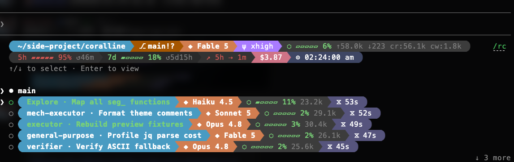
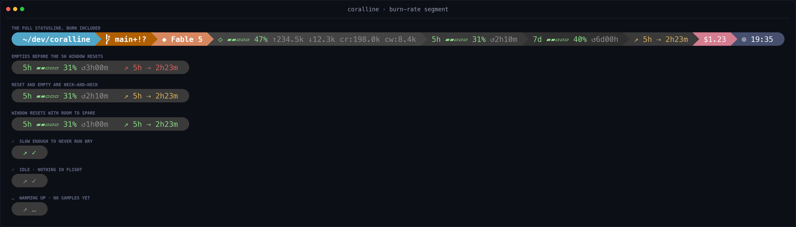
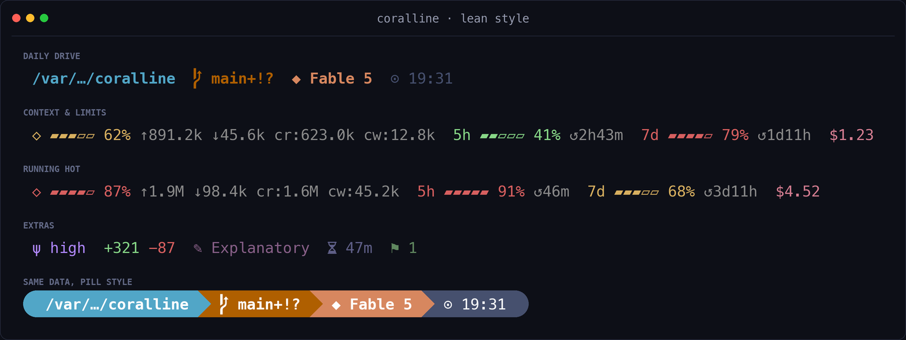
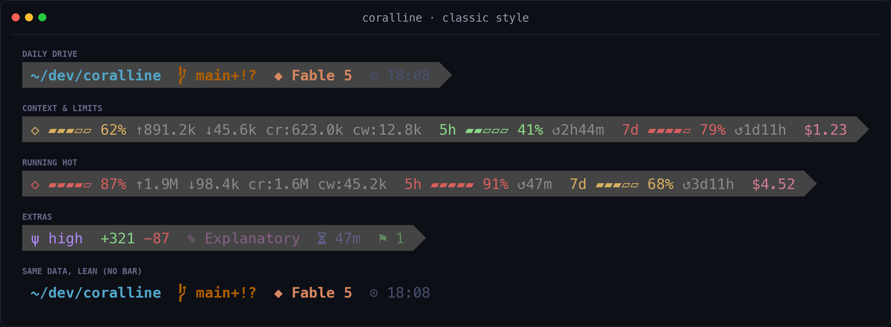
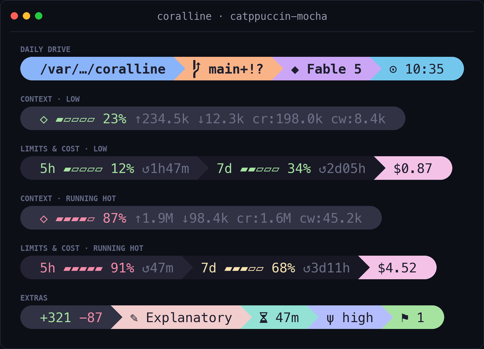
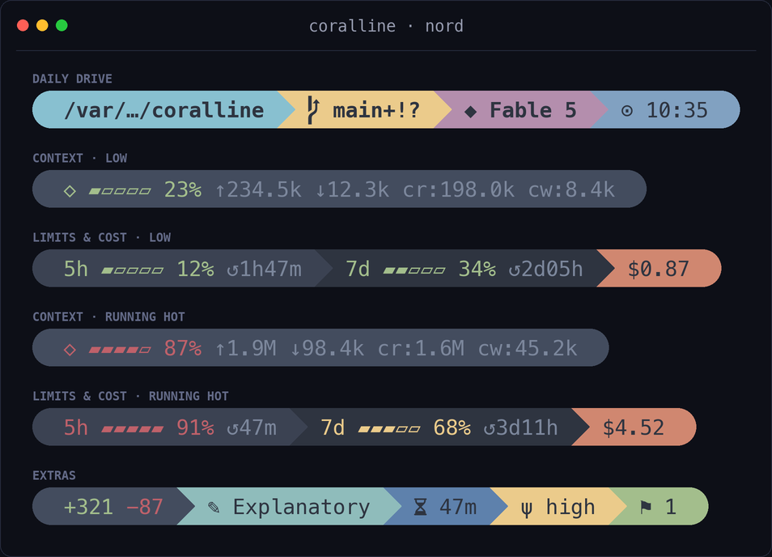
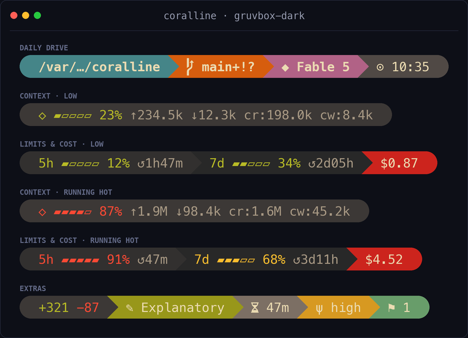
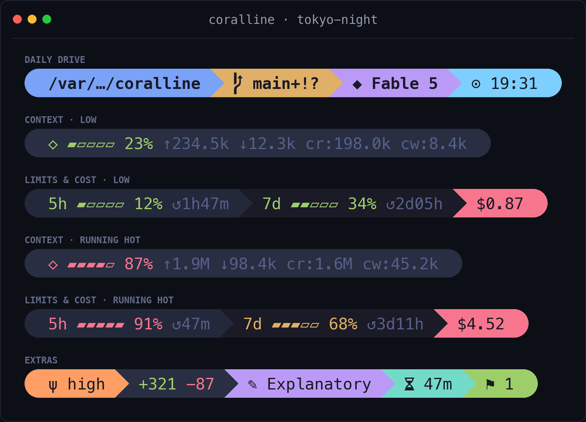
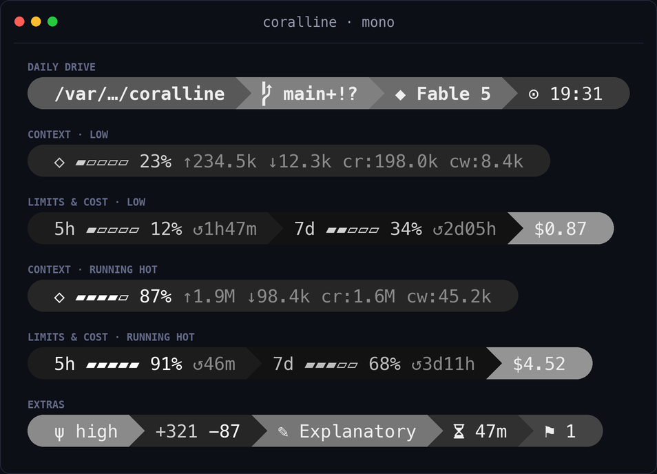
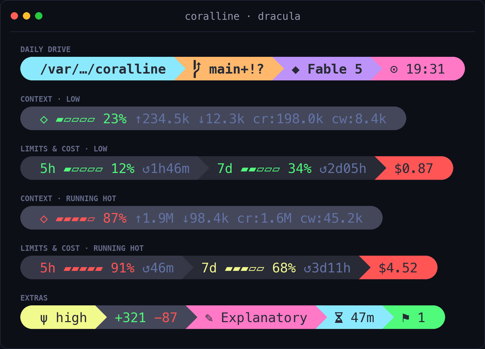

# coralline

> A fast, [Powerlevel10k](https://github.com/romkatv/powerlevel10k)-inspired statusline for
> Claude Code — a single **native binary** that **installs itself through your AI**: paste one
> prompt, answer a few questions about colors and layout, done.


## 🦀 Rust rewrite (this fork)

This fork ships **[coralline-rs](./rust/)** — a single self-contained native binary,
**byte-identical in output** to the bash `statusline.sh`, but far cheaper to run:

- **~100× faster spawn** — ~10 ms vs ~1–5 s for the `bash` + `jq` + `git` chain on
  Windows under load (every process launch is AV-scanned + fork-emulated there), and
  the cost no longer multiplies across many parallel sessions at `refreshInterval: 1`.
- **No `jq` dependency** (`git` optional) — one static binary, nothing to install.
- **Cross-platform**: Linux, macOS (arm64 + x86_64), Windows — verified byte-identical
  to the bash renderer by CI on all three.
- **Extra segment** beyond upstream: `worktree` — the linked-worktree name as its own
  `⑂` pill (compose with `project` + `dir`).

Prebuilt binaries: [Releases](../../releases). Details: **[rust/README.md](./rust/README.md)**
and the AI installer **[rust/INSTALL.md](./rust/INSTALL.md)**. The bash statusline below
remains fully supported.

## Install (the fun way)

Paste this into Claude Code:

```text
Please install coralline-rs (the native Rust build) for me:
fetch https://raw.githubusercontent.com/Catapultam-GMG/cc-coralline-rust/rust/rust/INSTALL.md
and follow the playbook in it.
```

Claude will ask you to pick a theme (with previews), choose which segments you want, decide
between a one-line or two-line layout, then wire everything up and verify it. No manual
config editing required.

## What you get

```text
╭ ~/side-project/coralline  ⎇ main+!  ◆ Fable 5  ⬡ ▰▰▰▱▱ 62% ↑1.2M ↓45.6k  5h ▰▰▱▱▱ 41% ↺2h44m  $1.23  ⊙ 02:45 pm ╮
```

| Segment | Shows |
|---|---|
| `dir` | current directory, long paths collapsed to `~/a/…/z` |
| `project` | repo name (`⬢`), stable across every worktree; hidden outside a git repo |
| `worktree` | linked-worktree name (`⑂`) — coralline-rs addition; hidden in the main worktree |
| `git` | branch, staged `+` / modified `!` / untracked `?`, ahead `⇡` behind `⇣` |
| `node` | active Node version (Nerd Font `nf-dev-nodejs_small`) from `.nvmrc` / `.node-version` (or `node` on `PATH` with `VL_RUNTIME_PROBE=1`); hidden when undetected; opt-in |
| `python` | active Python env (Nerd Font `nf-dev-python`) — `$VIRTUAL_ENV` / conda (skips `base`) / `.python-version` (or `python3` on `PATH` with `VL_RUNTIME_PROBE=1`); hidden when undetected; opt-in |
| `model` | active Claude model |
| `ctx` | context-window gauge, input/output/cache token counts |
| `limit5h` / `limit7d` | rate-limit gauges with reset countdown |
| `burn` | range-to-empty: projected time until the binding limit (5h or 7d) hits 100% at the recent burn rate (`↗`); opt-in by adding `burn` to `VL_SEGMENTS` |
| `cost` | session cost in USD |
| `clock` | time, 12h or 24h |
| `lines` | lines added/removed this session |
| `style` | active output style |
| `duration` | session wall-clock duration |
| `effort` | reasoning effort level (`ψ`) — `low` / `med` / `high` / `xhigh` / `max` |
| `stash` | git stash count |

Gauges change color as they fill: green → yellow at 50% → red at 75% (thresholds configurable).

## Subagent panel

Claude Code shows an agent panel below the prompt while subagents run; each row
defaults to `name · description · token count`. coralline can theme the
**subagent rows** and add the per-task model, a context gauge, and elapsed time:

```text
 scout · Explore config sources ◆ gpt-5.6-luna ⬡ ▰▰▱▱▱ 21% 42.0k ⧖ 2m05s
 executor · Apply R2 fixes ◆ Fable 5 ⬡ ▰▰▰▰▱ 77% 155.0k ⧖ 45s
```



Claude Code v2.1.211 does not include its internal `agentType` role in the
`subagentStatusLine` payload, but local Agent tasks have a small metadata
sidecar next to the session transcript. coralline reads that file with Bash
builtins, so roles such as `scout` and `executor` return without another
process. The row keeps both identity and task label: an explicit per-task
`name` is retained alongside the role when both exist, followed by `label` or
`description`. If the sidecar is absent or unreadable, the payload fields still
render normally.

The model comes directly from Claude Code's per-task `model` payload field;
coralline never infers it from the main-session model or the agent role. Known
Claude IDs are shortened (`claude-haiku-4-5-…` → `Haiku 4.5`), while unknown or
gateway IDs such as `gpt-5.6-luna` are shown verbatim.

Enable or disable the renderer directly:

```bash
bash ~/.claude/coralline/configure.sh --subagent-rows=on
bash ~/.claude/coralline/configure.sh --subagent-rows=off
```

The setup wizard offers the same toggle. Disabling removes only the
`subagentStatusLine` entry and preserves every other Claude setting.

Per-task `model` and `contextWindowSize` need Claude Code **v2.1.205+**. Missing
fields degrade one segment at a time: no model hides only the model segment;
`tokenCount` still renders as a bare count without `contextWindowSize`; and the
rest of the row remains themed. Refresh is panel-event-driven rather than a
fixed one-second poll, so elapsed time changes when Claude Code redraws the
panel.

Live payloads currently expose no per-task *effort*. coralline does not reuse
the main-session effort or guess from the role; effort can be added only if
Claude Code exposes it later. The panel's native **main-session row remains
visible** because it is outside the `subagentStatusLine` protocol; only the
subagent rows are replaced and themed.

`VL_SUB_SEGMENTS` (default `"name model ctx elapsed"`) picks and orders the row
segments. These four are the complete set:

| Segment | Shows | Hidden when |
|---|---|---|
| `name` | task identity plus task label: explicit `name` and sidecar `agentType` compose when both exist, followed by payload `label` or `description`; `type` is the final fallback; colored by status — running: text color, completed: ok, failed: hot, missing/unknown: dim | every source is empty or unavailable |
| `model` | `◆` model from Claude Code's per-task payload; known Claude IDs are shortened and unknown/gateway IDs are shown verbatim | model not resolved yet, or pre-v2.1.205 |
| `ctx` | `⬡` context gauge + token count; bare count without `contextWindowSize` | no `tokenCount` |
| `elapsed` | `⧖` wall-clock since `startTime`, shown to the second (epoch s/ms or UTC ISO) | `startTime` missing or unparseable |

The renderer shares your config file but reads only the knobs that shape a row:
`VL_STYLE` with its per-style knobs — the pill caps and separator (`VL_CAP_L`,
`VL_CAP_R`, `VL_SEP`) and the lean/classic family (`VL_LEAN_SEP`, `VL_LEAN_BG`,
`VL_LEAN_CAP_L`/`VL_LEAN_CAP_R`, `VL_LEAN_FG`, `VL_BG_BAR`) — `VL_ASCII`,
`VL_NAME_MAX` (recommended — panel labels are long, and overlong rows are
clipped from the right, hiding model/ctx first), the gauge knobs
(`VL_BAR_WIDTH`, `VL_BAR_FILL`, `VL_BAR_EMPTY`, `VL_WARN_PCT`, `VL_HOT_PCT`),
the shared palette (`VL_FG_TEXT`, `VL_FG_DIM`, `VL_FG_OK`, `VL_FG_WARN`,
`VL_FG_HOT`), and the row colors `VL_BG_SUB_NAME` / `VL_BG_SUB_MODEL` /
`VL_BG_SUB_CTX` / `VL_BG_SUB_ELAPSED` (empty = fall back to `VL_BG_DIR` /
`VL_BG_MODEL` / `VL_BG_CTX` / `VL_BG_DURATION`). Everything else —
`VL_SEGMENTS*`, layout (`VL_LAYOUT`, `VL_MAX_LINES`, `VL_WRAP_MARGIN`), clock,
cost, lines, float, limit-sync, burn, git, and the runtime segments — is
main-bar-only and ignored here. To theme panel rows independently of the main
bar, point the registration at its own config file:
`CORALLINE_CONFIG=~/.claude/coralline-subagent.conf bash ~/.claude/coralline/statusline.sh --subagent`.

## Why it's fast

coralline-rs is a single native binary — no `bash`, no `jq`, no per-render subprocess chain. It
makes no network or API calls and uses zero tokens: Claude Code pipes the session JSON to it on
stdin and renders whatever it prints. A render is a native process spawn (~10 ms) plus a
sub-millisecond parse, so it stays cheap at `refreshInterval: 1` even across many parallel
sessions. Git is read straight from `.git` — the branch instantly from `HEAD`, and dirty marks /
ahead-behind from a cache refreshed in the background — so the foreground never blocks on `git`.

## Manual install

Grab the binary for your platform (these are stable always-latest links) and put it on `PATH`:

> If your Claude flags the install playbook and wants to inspect things first, that is the
> right instinct, not an obstacle: see [Trust and security](#trust-and-security).

```bash
# Linux x86_64 — see Releases for macOS arm64/x86_64 and Windows
mkdir -p ~/bin
curl -fsSL https://github.com/Catapultam-GMG/cc-coralline-rust/releases/latest/download/cc-coralline-rust-linux-x86_64.tar.gz | tar -xz -C ~/bin
```

Or build it yourself: `cd rust && cargo build --release` (see [rust/README.md](./rust/README.md)).
Then register it in `~/.claude/settings.json`:

```json
{
  "statusLine": {
    "type": "command",
    "command": "/home/you/bin/coralline",
    "refreshInterval": 1
  }
}
```

> On **Windows**, use a forward-slash path (`C:/Users/you/bin/coralline.exe`) — Claude Code runs
> the command through Git Bash, which eats backslashes. A [Nerd Font](https://www.nerdfonts.com/)
> terminal is recommended; without one, set `VL_ASCII=1`.

<details>
<summary>Prefer the original bash statusline?</summary>

It's still here — no compiler needed, but it requires `jq`:

```bash
git clone https://github.com/Catapultam-GMG/cc-coralline-rust ~/.claude/coralline-src
mkdir -p ~/.claude/coralline/themes
cp ~/.claude/coralline-src/statusline.sh ~/.claude/coralline/
cp ~/.claude/coralline-src/themes/claude-coral.conf ~/.claude/coralline/themes/
```

…then set `"command": "bash ~/.claude/coralline/statusline.sh"` in `settings.json`.
</details>

### Updating

The native binary: download the newest release over the old one (the links above are
stable always-latest). The bash statusline: re-run the installer — it preserves
`~/.claude/coralline.conf`, backs up the previous `statusline.sh` under
`~/.claude/coralline/` (the 3 newest are kept), and prints a short "new since your
installed copy" report when something new shipped:

```bash
curl -fsSL https://raw.githubusercontent.com/Catapultam-GMG/cc-coralline-rust/rust/install.sh | bash -s -- --repo Catapultam-GMG/cc-coralline-rust --install-only
```

Or paste this into Claude Code and let it drive:

```text
Please update coralline for me:
fetch https://raw.githubusercontent.com/Catapultam-GMG/cc-coralline-rust/rust/UPGRADE.md
and follow the playbook in it.
```

## Trust and security

The Ask-Claude install is a remote document that instructs an AI to run `curl | bash` and
touch `~/.claude/settings.json`. That shape is exactly what a prompt-injection attack looks
like, so a Claude that red-flags it before proceeding is behaving correctly. The answer to
that skepticism is inspection, not trust:

- **Read what runs.** Everything is in this repo: [install.sh](./install.sh) (about 270
  lines) copies files and merges the core `statusLine` key into `settings.json`; the optional
  `subagentStatusLine` key is written only after an explicit yes. [INSTALL.md](./INSTALL.md)
  and [rust/INSTALL.md](./rust/INSTALL.md) are the playbooks the AI follows. Have your Claude
  read them before approving anything; that is the intended flow.
- **Pin a release.** `... | bash -s -- --ref <tag>` installs a tagged release instead of
  the branch head, so what you audited is what you run. The interactive installer already
  offers the latest tag by default.
- **What gets written, exactly:** files under `~/.claude/coralline/`, your choices in
  `~/.claude/coralline.conf`, and the core `statusLine` entry in
  `~/.claude/settings.json`. If you explicitly enable themed subagent rows, coralline also
  writes `subagentStatusLine`. A timestamped `settings.json.bak.*` backup is created before
  either merge; no other Claude settings are changed.
- **What runs afterwards:** the statusline renders on every prompt and makes zero network
  requests at runtime. The native binary spawns no subprocess chain; a bash main render uses
  one `jq` and at most one `git`, and a subagent-panel render uses one `jq`, no `git`, and
  Bash builtins for local role metadata. Your prompts, keys, and usage data never leave the
  machine.
- **Why INSTALL.md addresses the AI:** humans get the visual wizard, AIs get an interview
  script, so the playbook speaks to the reader that executes it. A document that opens by
  addressing your AI deserves scrutiny, which is why every artifact it references lives in
  this repo where both of you can read it first.

### Uninstall

If you enabled themed subagent rows, remove their settings entry before deleting the tools:

```bash
bash ~/.claude/coralline/configure.sh --subagent-rows=off
rm -rf ~/.claude/coralline ~/.claude/coralline.conf
```

Then delete the `statusLine` block from `~/.claude/settings.json` (or restore the newest
`settings.json.bak.*`), and remove the binary from your `PATH` if you installed
coralline-rs. If you skipped the first command, also delete `subagentStatusLine`.

### Platform support

The native binary is a self-contained executable — no shell, no `jq`, no Git Bash:

| Platform | Native binary | Bash fallback |
|---|---|---|
| macOS | ✅ supported | ✅ supported (stock bash 3.2) |
| Linux | ✅ supported | ✅ supported |
| Windows + Git Bash | ✅ supported | ✅ supported (needs `jq`) |
| Windows without Git Bash | ✅ supported — Claude Code runs the `.exe` directly | ❌ Claude Code falls back to PowerShell, which can't run the bash script |

> **Windows note:** the native `.exe` is the recommended path — it runs directly from
> `settings.json` with no Git Bash or `jq` dependency. The bash fallback still works under Git
> Bash; its render path stays cheap under Git Bash's emulated `fork()` — one `jq`, one `git`, and
> no per-field subprocess spawning.

## Configuration

Everything lives in `~/.claude/coralline.conf` (plain bash, sourced by the script):

| Variable | Default | Meaning |
|---|---|---|
| `VL_STYLE` | `pill` | `pill`: powerline pills · `lean`: flat colored text · `classic`: lean on a uniform dark bar (p10k classic) |
| `VL_LAYOUT` | `fixed` | `fixed`: one line per `VL_SEGMENTS*` var · `auto`: responsive |
| `VL_MAX_LINES` | `3` | `auto` only — wrap into at most this many lines (`1` = never wrap) |
| `VL_WRAP_MARGIN` | `4` | `auto` only — columns kept free on the right so segments never touch the edge |
| `VL_SEGMENTS` | `dir git model ctx limit5h limit7d cost clock` | segments on line 1, in order (the full list in `auto` mode) |
| `VL_SEGMENTS2` / `VL_SEGMENTS3` | _(empty)_ | `fixed` only — optional second/third line |
| `VL_CLOCK` | `12h` | `12h` / `24h` / `off` |
| `VL_CLOCK_SECONDS` | `1` | show seconds in the clock |
| `VL_BAR_WIDTH` | `5` | gauge width in cells |
| `VL_PATH_DEPTH` | `4` | collapse paths deeper than this |
| `VL_NAME_MAX` | `0` | max chars for the `project` / `git` names before `…` truncation (`0` = off) |
| `VL_COST_DECIMALS` | `2` | decimal places for the cost segment |
| `VL_WARN_PCT` / `VL_HOT_PCT` | `50` / `75` | gauge color thresholds |
| `VL_ASCII` | `0` | `1` disables Nerd Font glyphs |
| `VL_RUNTIME_PROBE` | `0` | `node` / `python`: `1` = also detect via `node` / `python3` on `PATH` when no pin file (forks per render) |
| `VL_BG_*` / `VL_FG_*` | theme | colors — `256`-color index or `"R,G,B"` |

### Burn-rate segment



Off by default. Add `burn` to `VL_SEGMENTS` to show a "range to empty" — the projected
time until whichever rate limit (5h or 7d) binds first, e.g. `↗ 5h ⇢ 1h58m`. Keys:
`CORALLINE_BURN_WINDOW` (recent-slope lookback, default 600s), `VL_BURN_GLYPH` (default
`↗`), `VL_BG_BURN` (defaults to the 5h background). While `burn` is in the segment list,
coralline writes samples to `~/.claude/coralline/burn-5h.tsv`; drop it from the list and
nothing is written.

The ETA is coloured by urgency against the window reset, and collapses to a glyph when a
number would be noise:

| You see | When |
|---|---|
| `↗ 5h ⇢ 1h58m` **red** | you'd empty *before* the window resets |
| `↗ 5h ⇢ 1h58m` **yellow** | reset and empty are a close call |
| `↗ 5h ⇢ 1h58m` **green** | the window resets with room to spare |
| **bright** `↗ ✓` | at this pace a full window can't run dry — a number like `24d15h` would just be noise |
| **dim** `↗ ✓` | idle: you've stopped burning, nothing in flight |
| **dim** `↗ …` | warming up: a cold start with no samples yet (deliberately *not* a green check, so a fresh install doesn't read as healthy) |

The label tells you which limit binds — whichever of `5h`/`7d` will hit 100% soonest.
`5h` only appears once you're burning hard enough to register at least two integer-%
steps within the recent window; at a light or steady pace there's no short-term slope to
fit, so the 7d projection binds and you see `↗ 7d`.

### Cross-session limit sync (optional)

`VL_LIMIT_SYNC=1` makes `limit5h` / `limit7d` show the freshest rate-limit reading any of your sessions has seen, instead of just this session's own snapshot. Each render records its `5h` / `7d` value to a small per-host store (`limit-5h.d` / `limit-7d.d`), and the segments display the highest percentage recorded for the current window. Off by default.

This exists because Claude Code re-renders a session's statusline only when that session is active, and the rate-limit numbers it passes are that session's last-seen values. So idle sessions show stale, divergent percentages. With sync on, every session converges to the latest known value the next time it redraws.

> **It only updates on redraw.** It cannot refresh a session that is not redrawing at all, and "latest known" is only as fresh as your most recently active session. coralline has no API access. So this narrows the gap between sessions, it does not make a fully idle bar live.

Single-session users gain nothing from it (there is only one snapshot), so it stays opt-in.

### Responsive layout

With `VL_LAYOUT="auto"` the bar stays on a single line while it fits, and greedily wraps into
up to `VL_MAX_LINES` rows when the window gets narrow. Once the line cap is reached, remaining
segments overflow on the last line. `VL_WRAP_MARGIN` keeps a few columns free on the right so
wrapped lines never butt against the window edge — raise it if your terminal adds padding.

Width comes from `$COLUMNS`. Claude Code v2.1.153+ sets `COLUMNS` to the current terminal width
before running the status line, so wrapping responds to window resizing out of the box. Outside
Claude Code the script falls back to `stty size` on the controlling terminal; if neither is
available it stays on one line.

```text
wide window:    ~/dev/app  ⎇ main  ◆ Fable 5  ⬡ ▰▰▰▱▱ 62%  5h ▰▰▱▱▱ 41%  $1.23  ⊙ 14:45

narrow window:  ~/dev/app  ⎇ main  ◆ Fable 5
                ⬡ ▰▰▰▱▱ 62%  5h ▰▰▱▱▱ 41%  $1.23  ⊙ 14:45
```

Prefer a layout that never moves? Keep `VL_LAYOUT="fixed"` and pin rows with
`VL_SEGMENTS` / `VL_SEGMENTS2` / `VL_SEGMENTS3`.

### Lean style

Prefer Powerlevel10k's *lean* look — no backgrounds, just colored text? Set
`VL_STYLE="lean"` and each segment's `VL_BG_*` color becomes its text accent instead:



| Variable | Default | Meaning |
|---|---|---|
| `VL_STYLE` | `pill` | set to `lean` for the flat look |
| `VL_LEAN_SEP` | _(empty)_ | extra text between segments, e.g. `·` |
| `VL_LEAN_FG` | _(empty)_ | force a text color; empty = inherit each segment's accent |
| `VL_LEAN_BG` | _(empty)_ | paint one uniform background behind the row — `"R,G,B"` or 256 index. For the full p10k *classic* look, prefer the `VL_STYLE="classic"` preset below — it wires this up for you |
| `VL_LEAN_CAP_R` | _(empty)_ | trailing cap glyph drawn in the `VL_LEAN_BG` color to bevel the bar's end into the terminal (p10k's end separator, e.g. `$''`); needs `VL_LEAN_BG` |
| `VL_LEAN_CAP_L` | _(empty)_ | leading cap glyph — the left-facing mirror of `VL_LEAN_CAP_R` at the bar's start (e.g. `$''`); needs `VL_LEAN_BG`. Stock p10k *classic* leaves it flat |

> **Tip:** already a p10k user? Tell the AI installer to import your `~/.p10k.zsh` — it will
> carry over your style, colors, and time format. See the
> [Powerlevel10k import step in INSTALL.md](./INSTALL.md#step-25--powerlevel10k-import-optional).

### Classic style

Want Powerlevel10k's stock *classic* prompt — one uniform dark bar with colored
text and a solid end cap? Set `VL_STYLE="classic"`. It's a one-word preset: it
renders like `lean` on a dark bar (p10k's `POWERLEVEL9K_BACKGROUND`) with a
trailing powerline cap, no other knobs required.



| Variable | Default | Meaning |
|---|---|---|
| `VL_STYLE` | `pill` | set to `classic` for the p10k dark-bar look |
| `VL_BG_BAR` | _(empty → `238`)_ | the uniform bar color behind the row — `"R,G,B"` or 256 index. Any theme's palette rides this bar; grayscale palettes (e.g. `mono`) want an explicit `VL_BG_BAR` for contrast |

Under the hood `classic` is `lean` plus a `VL_LEAN_BG` (from `VL_BG_BAR`) and a
`VL_LEAN_CAP_R` end cap, so an explicit `VL_LEAN_BG` or cap still wins. Importing
a p10k *classic* config carries over your exact bar color and separator.

## Float readout (optional)

`VL_FLOAT=1` makes `statusline.sh` write a one-line **plain-text** readout to
`~/.claude/coralline/float.txt` on every render (segments from
`VL_FLOAT_SEGMENTS`, default `model ctx cost`). That's all coralline does —
it ships **no display carrier**. The file is the seam: pipe it wherever you want
a glanceable readout that stays visible without looking at Claude Code's bottom
statusline (a terminal status bar, tmux, a menu-bar app, …).

The readout is **plain text** (no ANSI color), so the default favors stable,
glance-friendly segments and leaves the color-driven limit warnings
(`limit5h` / `limit7d`) in the bottom statusline, where threshold colors work.
You can still add them to `VL_FLOAT_SEGMENTS` if you want the numbers up top.

**Config keys**

| Key | Default | Meaning |
|---|---|---|
| `VL_FLOAT` | `0` | `1` = write `float.txt` each render |
| `VL_FLOAT_SEGMENTS` | `model ctx cost` | segments rendered into the readout (plain text, no color) |
| `VL_FLOAT_SEP` | `  ·  ` | separator between segments |
| `VL_FLOAT_FILE` | `~/.claude/coralline/float.txt` | where the readout is written |

(Or toggle `VL_FLOAT` via "float readout" in `configure.sh`'s Details menu.)

A worked iTerm2 carrier (the `coralline-float` companion + setup steps) lives in
[`example/float-display-iterm2/`](example/float-display-iterm2/) — copy it into
your dotfiles and adapt. Other terminals (tmux, WezTerm, a menu-bar app, …) just
need to read `float.txt` the same way.

## Themes

| | |
|---|---|
| **`claude-coral`** — steel blue · mauve · Claude coral (default)<br> | **`catppuccin-mocha`** — soft pastels on dark<br> |
| **`nord`** — arctic frost<br> | **`gruvbox-dark`** — warm retro<br> |
| **`tokyo-night`** — neon on deep navy<br> | **`mono`** — grayscale minimalism<br> |
| **`dracula`** — cyan · pink · purple on charcoal<br> | |

A theme is just a `.conf` file assigning `VL_BG_*` / `VL_FG_*` — copy one, change the colors,
and source yours from `coralline.conf` instead. PRs with new themes are welcome.

> **Adding a theme?** Copy an existing `.conf`, set every `VL_BG_*` / `VL_FG_*`
> (including `VL_BG_EFFORT`; `VL_BG_BAR` is optional — only grayscale palettes need
> it, to keep the classic bar readable), add its name to the `THEMES` list in
> [`tools/render-screenshots.py`](./tools/render-screenshots.py), re-run it to generate
> `assets/theme-<name>.png`, and add a row to the table above. Please **don't regenerate
> `hero.png`** — it's a fixed sampler of the original six themes, not a full catalog.

## Acknowledgements

The visual language of coralline — segmented pills, powerline transitions, the `⇡⇣` git
glyphs, gauges that shift color as they fill — is a loving tribute to
[Powerlevel10k](https://github.com/romkatv/powerlevel10k) by
[@romkatv](https://github.com/romkatv), which set the bar for what a fast, beautiful prompt
can be. Thanks also to the wider [powerline](https://github.com/powerline/powerline) lineage
that started it all, and to [Nerd Fonts](https://www.nerdfonts.com/) for the glyphs that make
the pill shapes possible.

Above all, this fork stands on [coralline](https://github.com/Nanako0129/coralline) by
[@Nanako0129](https://github.com/Nanako0129) — coralline-rs is a Rust port of that project,
and the bash statusline here is their original work.

As for the name: coralline algae build reefs one thin, colorful layer at a time —
and **coral·line** is exactly what this is: a line, in Claude's coral.

## License

[MIT](./LICENSE)
